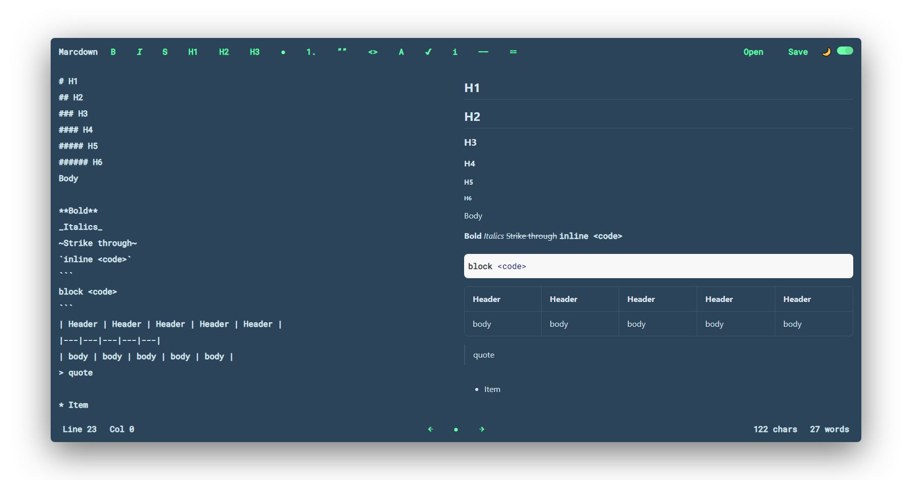

[](https://travis-ci.com/liyasthomas/marcdown) [](https://github.com/liyasthomas/marcdown/releases/latest) [](https://github.com/liyasthomas/marcdown/archive/master.zip) [](https://github.com/liyasthomas/marcdown/blob/master/LICENSE) [](https://github.com/liyasthomas/marcdown/issues) [](https://liyas-thomas.firebaseapp.com) [](https://www.paypal.me/liyascthomas)

#  Marcdown

### 👻 Lightweight markdown viewer and editor by [Liyas Thomas](https://github.com/liyasthomas)

<div align="center">
  <br>
  
  
  <br>
</div>

### Features :sparkles:

:heart: **Lightweight and minimal**: Crafted with minimalistic UI design

:electric_plug: **Real-time editor**: WYSIWYG (what you see is what you get) markdown editor using **[MarkedJS](https://marked.js.org)**

- Built for speed
- Light-weight while implementing all markdown features from the supported flavors & specifications.

:pen: **Code highlighting**: Syntax highlighting with **[highlightjs](https://highlightjs.org)**

- 185 languages and 89 styles
- Automatic language detection
- Multi-language code highlighting

:triangular_ruler: **Math support**: **[MathJax](https://www.mathjax.org)** for LaTeX, MathML, and AsciiMath notations

- Use MathML, TeX, and ASCIImath as input and produce HTML+CSS, SVG, or MathML as output.

:globe_with_meridians: **PWA**: Progressive web app.

- Works offline after first use
- Install as a Web app on your phone or Desktop app on your PC

:zap: **Real-time viewer**: View changes as you type

:raised_hand_with_fingers_splayed: **Drag and drop**: Grab a markdown file and drop to the editor

:scroll: **Scroll sync**: Editor and viewer scroll along with you

:crescent_moon: **Dark mode**: Turn the lights off!

---

## Getting started

These instructions will get you a copy of the project up and running on your local machine for development and testing purposes. See deployment for notes on how to deploy the project on a live system.

### Prerequisites

What things you need to install the software and how to install them.

* Marcdown can be embedded into any web page consisting a `<textarea></textarea>` tag.
* A browser with [ES6 support](https://caniuse.com/#feat=es6).
* [Wonder](https://en.wikipedia.org/wiki/Wonder_(emotion))! :heart:

---
## Demo

[https://liyasthomas.github.io/marcdown](https://liyasthomas.github.io/marcdown)

1. Paste/type markdown on left
2. View preview on right
3. Save Markdown file

You're done!

---

### Installing

A step by step series of examples that tell you've to get a development environment running.

### Step 1: Include **[MarkedJS](https://marked.js.org)** and **[Marcdown.js](https://liyasthomas.github.io/marcdown)**

`<script src="https://cdn.jsdelivr.net/npm/marked/marked.min.js"></script>`

`<script src="https://cdn.jsdelivr.net/gh/liyasthomas/marcdown/marcdown.min.js"></script>`

### Step 2: Define a `<textarea id="getm" onkeyup="keyUp()"></textarea>` tag inside `<body></body>`

`<textarea id="getm" placeholder="paste markdown here ✨" onkeyup="keyUp()"></textarea>`

### Step 3: Define a `<div id="viewer"></div>` tag inside `<body></body>`

`<div id="viewer"></div>`

### Step 4: Define buttons with actions such as bold, italic, strike, h1, ul, ol, code, link etc.

`<button onclick="apply('bold')" title="Bold">B</button>`

Full list of actions:

`<button onclick="apply('bold')" title="Bold">B</button>`

`<button onclick="apply('italic')" title="Italic"><i>I</i></button>`

`<button onclick="apply('strike')" title="Strikethrough"><strike>S</strike></button>`

`<button onclick="apply('h1')" title="Header 1">H1</button>`

`<button onclick="apply('h2')" title="Header 2">H2</button>`

`<button onclick="apply('h3')" title="Header 3">H3</button>`

`<button onclick="apply('ul')" title="Unordered list">●</button>`

`<button onclick="apply('ol')" title="Ordered list">1.</button>`

`<button onclick="apply('check')" title="Check list">✔</button>`

`<button onclick="apply('bq')" title="Blockquote">””</button>`

`<button onclick="apply('ic')" title="Inline code">I&lt;></button>`

`<button onclick="apply('bc')" title="Block code">&lt;>B</button>`

`<button onclick="apply('link')" title="Link">A</button>`

`<button onclick="apply('image')" title="Image">I</button>`

`<button onclick="apply('hr')" title="Horizontal rule">——</button>`

`<button onclick="apply('table')" title="Table">⚏</button>`

## Example HTML file:

```
<!DOCTYPE html>
<html lang="en">

<head>
	<meta charset="UTF-8">
	<title>Marcdown</title>
	<script src="https://cdn.jsdelivr.net/npm/marked/marked.min.js"></script>
	<script src="https://cdn.jsdelivr.net/gh/liyasthomas/marcdown/marcdown.min.js"></script>
</head>

<body>
	<textarea id="getm" placeholder="paste markdown here ✨" onkeyup="keyUp()"></textarea>
	<button onclick="apply('bold')" title="Bold">B</button>
	<button onclick="apply('italic')" title="Italic"><i>I</i></button>
	<button onclick="apply('strike')" title="Strikethrough"><strike>S</strike></button>
	<button onclick="apply('h1')" title="Header 1">H1</button>
	<button onclick="apply('h2')" title="Header 2">H2</button>
	<button onclick="apply('h3')" title="Header 3">H3</button>
	<button onclick="apply('ul')" title="Unordered list">●</button>
	<button onclick="apply('ol')" title="Ordered list">1.</button>
	<button onclick="apply('check')" title="Check list">✔</button>
	<button onclick="apply('bq')" title="Blockquote">””</button>
	<button onclick="apply('ic')" title="Inline code">I&lt;></button>
	<button onclick="apply('bc')" title="Block code">&lt;>B</button>
	<button onclick="apply('link')" title="Link">A</button>
	<button onclick="apply('image')" title="Image">I</button>
	<button onclick="apply('hr')" title="Horizontal rule">——</button>
	<button onclick="apply('table')" title="Table">⚏</button>
	<div class="markdown" id="viewer"></div>
</body>

</html>
```

---

## Deployment

Add additional notes about how to deploy this on a live system.

```
Will be explained later
```

---

## Built with

* **[MarkedJS](https://marked.js.org)** - For markdown parser
* **[highlightjs](https://highlightjs.org)** - For code highlighting
* **[MathJax](https://www.mathjax.org)** - For LaTeX, MathML, and AsciiMath notations
* **[Chromium](https://github.com/chromium/chromium)** - Thanks for being so fast!
* HTML - For the web framework
* CSS - For styling components
* JavaScript - For magic!

---

## Contributing

Please read [CONTRIBUTING](CONTRIBUTING.md) for details on our [CODE OF CONDUCT](CODE_OF_CONDUCT.md), and the process for submitting pull requests to us.

---

## Continuous Integration

We use [Travis CI](https://travis-ci.com) for continuous integration. Check out our [Travis CI Status](https://travis-ci.com/liyasthomas/marcdown).

---

## Versioning

This project is developed by [Liyas Thomas](https://github.com/liyasthomas) using the [Semantic Versioning specification](https://semver.org). For the versions available, see the [releases on this repository](https://github.com/liyasthomas/marcdown/releases).

---

## Change log

See the [CHANGELOG](CHANGELOG.md) file for details.

---

## Authors

### Lead Developers
* [**Liyas Thomas**](https://github.com/liyasthomas) - *Author*

### Thanks
* [MarkedJS](https://marked.js.org)
* [highlightjs](https://highlightjs.org)

See the list of [contributors](https://github.com/liyasthomas/marcdown/graphs/contributors) who participated in this project.

---

## License

This project is licensed under the [MIT License](https://opensource.org/licenses/MIT) - see the [LICENSE](LICENSE) file for details.

---

## Acknowledgments

* Hat tip to anyone who's code was used
* Inspirations:
	* [StackEdit](https://stackedit.io)
	* [Dribbble](https://dribbble.com)
